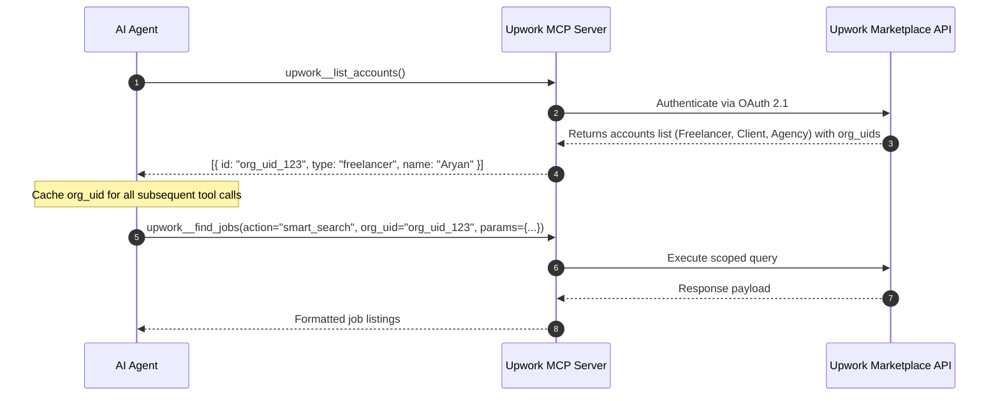
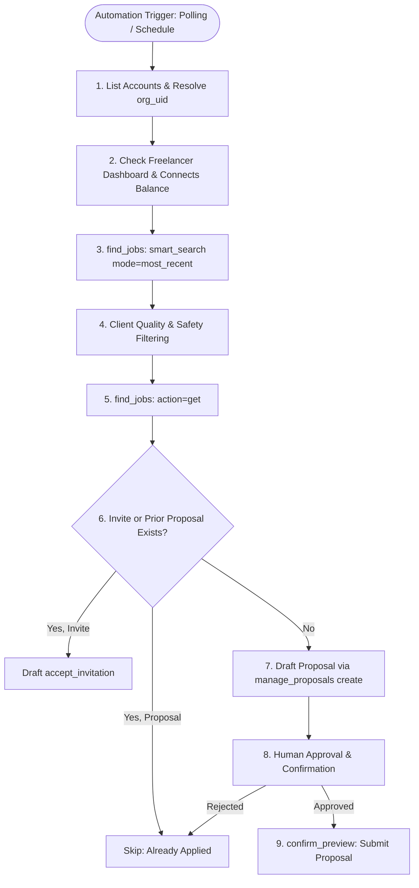

# Upwork Model Context Protocol (MCP) — Complete Capability & Automation Guide

## 1. Executive Summary & Core Architecture

The **Upwork Model Context Protocol (MCP) Server** is an official integration protocol that connects AI assistants and autonomous agents directly to the Upwork freelance marketplace. Operating via standard JSON-RPC 2.0 over standard I/O (stdio) or SSE, it exposes 51 specialized tools covering the entire Upwork ecosystem: job search, client intelligence, proposal generation, contract and milestone tracking, file management, messaging, and account administration.

### Architectural Philosophy: Two-Phase "Draft-and-Confirm" Safety Gate

To protect freelancers' Connects balance, prevent marketplace spam, comply with Upwork Terms of Service, and ensure human accountability for legal commitments:
1. **Separation of Read and Write Operations**: Search, retrieval, account introspection, and preview generation are read-only.
2. **Preview Phase (`manage_proposals`, `post_job`, etc.)**: Write actions return a staged preview containing a server-generated `preview_id`, cost analysis (Connects required, balance remaining), competing bid telemetry, and validation warnings.
3. **Confirmation Phase (`confirm_preview`)**: The staged action is **only executed** when the client explicitly invokes `confirm_preview` with the `preview_id` and `type`.
4. **Legally Binding Exceptions**: Accepting contract offers (`respond_to_offer` `action=accept`) is **never executed autonomously** via MCP; it returns a secure `finalize_url` that the human freelancer must review and sign directly on upwork.com.

---

## 2. Authentication & Account Context Setup

All Upwork MCP operations (except `list_accounts`) require an organizational user context parameter: `org_uid`.



### Initial Handshake Workflow
1. **Call `upwork__list_accounts`**:
   ```json
   {}
   ```
2. **Capture `org_uid`**: The response lists available accounts (Freelancer, Client, Agency) and their respective `org_uid` values.
3. **Inject `org_uid`**: Every subsequent tool call must provide:
   ```json
   {
     "action": "<action_name>",
     "org_uid": "<your_freelancer_org_uid>",
     "params": { ... }
   }
   ```

---

## 3. Comprehensive Capabilities Matrix (51 Tools)

| Category | Tools | Capabilities |
| :--- | :--- | :--- |
| **Account & Identity** | `list_accounts`, `get_account`, `update_account`, `set_tool_mode`, `set_tool_permission`, `get_tool_help` | Enumerate identities, fetch account profiles, inspect schemas, switch between `full_list` and `search_execute` modes, configure approval policies. |
| **Job Search & Market Intelligence** | `find_jobs`, `find_saved_jobs`, `save_job`, `get_job_posting`, `get_rate_insights` | Query marketplace jobs, execute personalized smart searches, analyze client hiring history, bookmark/hide jobs, fetch going market rates. |
| **Freelancer Profile & Portfolio** | `get_profile`, `update_profile`, `boost_profile`, `get_freelancer_dashboard`, `get_freelancer_financials` | Inspect profile ratings, pull portfolio highlights/certificates for proposals, monitor Connects balance, track earnings, toggle availability badges. |
| **Proposals & Offers** | `manage_proposals`, `list_freelancer_proposals`, `confirm_preview`, `get_preview`, `confirm_draft`, `get_draft`, `list_offers`, `manage_offers`, `respond_to_offer` | Draft proposals, calculate Connects boost bids, answer screening questions, attach highlights, monitor proposal status, review competitor stats, counter/decline offers. |
| **Attachments & Storage** | `start_attachment_upload`, `confirm_attachment_upload`, `get_upload_status`, `store_uploaded_files` | Securely upload work samples, resumes, briefs, and attachments across message/proposal contexts. |
| **Messaging & Rooms** | `get_messages`, `send_message`, `agency_rooms` | Read threads, reply to prospective clients who reached out, create collaboration rooms, send attachments. |
| **Contracts & Milestones** | `list_contracts`, `update_contract`, `end_contract`, `list_milestones`, `manage_milestones`, `submit_milestones`, `manage_meetings` | Track active work, submit deliverables for payment, request milestone release, schedule or reschedule Zoom/Upwork meetings. |
| **Client & Agency Operations** | `find_freelancers`, `post_job`, `list_client_proposals`, `manage_client_proposals`, `invite_freelancer`, `list_client_invitations`, `manage_talent_lists`, `get_client_dashboard`, `get_client_financials`, `get_agency`, `update_agency`, `get_agency_dashboard` | Hire talent, draft client job postings, shortlist applicants, invite freelancers, manage agency teams. |

---

## 4. Deep Dive: Automating Job Proposal Finding for New Jobs

For a freelancer looking to build an automated, high-converting job finding and proposal drafting system, Upwork MCP provides the exact primitives needed.



### Step 1: Identifying the Optimal Job Discovery Endpoint

There are two primary ways to search jobs with `find_jobs`:

#### Method A: `smart_search` with `mode="most_recent"` (Recommended for New Jobs)
* **Why it excels for automation**: `smart_search` utilizes Upwork's internal recommendation engine tailored to the freelancer's specific skills, past contracts, and win rates.
* **The ONLY endpoint with true date filtering**:
  - `days_posted: 1` — filters strictly to jobs posted in the last 24 hours ("posted today").
  - `from_date` and `to_date` — accepts YYYY-MM-DD or RFC3339 timestamps for minute-level granularity.
* **Parameters**:
  ```json
  {
    "action": "smart_search",
    "org_uid": "<freelancer_org_uid>",
    "params": {
      "mode": "most_recent",
      "days_posted": 1,
      "verified_payment_only": true,
      "limit": 10
    }
  }
  ```

#### Method B: `search` for Keyword / Role Specific Targeting
* **Title Filtering**: Use `title` instead of `query` when targeting a specific role (e.g., `title: "Fullstack Node TypeScript"`). Title keywords are strictly ANDed and stemmed, eliminating irrelevant search noise.
* **Proposal Range Filter**: Set `proposals_max: 5` or `10` to discover fresh jobs before 50+ freelancers flood the listing.
* **Hourly Overlap Logic**:
  - `rate_min`: Matches jobs whose posted **maximum** is at least `rate_min`.
  - `rate_max`: Matches jobs whose posted **minimum** is at most `rate_max`.
* **Fixed-Price Budget**: Use `budget_min` and `budget_max`. Note: `budget_*` does NOT filter hourly jobs.
* **Parameters**:
  ```json
  {
    "action": "search",
    "org_uid": "<freelancer_org_uid>",
    "params": {
      "title": "Python AI",
      "job_type": "hourly",
      "rate_min": 50,
      "proposals_max": 10,
      "verified_payment_only": true,
      "client_hires_min": 1,
      "sort": "recency",
      "limit": 10
    }
  }
  ```

---

### Step 2: In-Depth Job Evaluation & Client Vetting (`find_jobs` `action=get`)

Never submit a proposal based solely on a search result snippet. Always fetch the full listing via `find_jobs` `action="get"`:

```json
{
  "action": "get",
  "org_uid": "<freelancer_org_uid>",
  "params": {
    "id": "<numeric_job_id_or_url>"
  }
}
```

#### Key Fields to Analyze:
1. **`client_record`**:
   - `total_spent`: Total lifetime amount paid by the client.
   - `hire_rate_percent`: Percentage of posted jobs that resulted in a hire (prefer > 50-60%).
   - `rating`: Freelancers' aggregate review score of the client (below 4.5 is a red flag).
   - `active_contracts` and `open_jobs`: Activity indicators.
2. **`activityStat.jobActivity` (The Live Funnel)**:
   - `invitesSent`: Number of direct invitations sent by the client.
   - `totalInvitedToInterview`: Applicants currently in dialogue.
   - `totalHired`: If greater than 0 on a single-hire job, the job is effectively closed!
   - `totalOffered`: Offers pending acceptance.
3. **`preferred_qualifications`**:
   - English level, Job Success Score (JSS), location, minimum earnings.
4. **`client_feedback` (Goldmine for Personalization)**:
   - Up to 5 recent reviews left by past freelancers.
   - **Crucial automation tip**: Freelancer reviews often mention the client contact by name (e.g., *"John was great to work with on the dashboard redesign"*). An automated proposal agent can extract the client's real name and open with *"Hi John,"* creating immediate rapport.
5. **`connects_cost` & `applied`**:
   - Verify `applied: false` and `can_apply: true`.

---

### Step 3: Mandatory Pre-Submission Checks (Preventing Upwork Error `VJ-JA-10`)

> [!IMPORTANT]
> Calling `manage_proposals` `action=create` on a job where you already have an invitation or an existing proposal triggers a hard platform error (`VJ-JA-10`). An automated agent MUST perform these two validation calls first:

1. **Check Invitations**:
   ```json
   {
     "action": "invitations",
     "org_uid": "<freelancer_org_uid>",
     "params": { "job_posting_id": "<numeric_job_id>" }
   }
   ```
   *If an invitation exists, you MUST use `manage_proposals` `action=accept_invitation` with the returned `invitation_uid` instead of `create`.*

2. **Check Existing Proposals**:
   ```json
   {
     "action": "list",
     "org_uid": "<freelancer_org_uid>",
     "params": { "status": "Pending" }
   }
   ```
   *Verify that no pending or active proposal exists for this `job_reference`.*

---

### Step 4: Proposal Generation, Screening, and Connects Boost Strategy

#### A. Fetching Dynamic Highlights (`get_profile` `action=list_highlights`)
Call `get_profile` `action="list_highlights"` to inspect your portfolio projects and verified certificates. Pass the most relevant identifiers into the proposal draft:
- `portfolio_project_ids`: `["project_id_1", "project_id_2"]`
- `certificate_ids`: `["cert_id_abc"]`

#### B. Screening Questions
If `find_jobs` `action=get` indicates screening questions, format your answers as:
```json
"answers": [
  {
    "question": "How many years of experience do you have with Fastify?",
    "answer": "Over 4 years building production microservices handling 10k+ req/sec."
  }
]
```

#### C. Smart Connects Boost Bidding
When invoking `manage_proposals` `action=create`, the returned preview analyzes the boost auction:
- `boost.available`: If `false`, do not attempt to boost.
- `boost.recommendation`: If `"skip"` (e.g. client already hired), do not boost.
- `boost.current_top_bids`: Actual real-time competing bids on this job.
- `boost.recommended_connects`: Smallest bid required to win a top placement (often 1-3 Connects on fresh jobs).
- `boost.max_boost_connects`: Available balance minus proposal application fee.
- **Rule**: Never bid below `boost.recommended_connects` (will be rejected), and never bid above `boost.max_boost_connects`.

#### D. Crafting the Draft via `manage_proposals` `action=create`
```json
{
  "action": "create",
  "org_uid": "<freelancer_org_uid>",
  "params": {
    "job_reference": "1849204910293847",
    "charged_amount": 65.0,
    "cover_letter": "Hi [Client Name],\n\nI reviewed your requirements for...",
    "boost_connects": 2,
    "portfolio_project_ids": ["proj_99182"],
    "answers": [...]
  }
}
```

---

### Step 5: The Preview & Human-in-the-Loop Confirmation Gate

The `create` action **does not submit the proposal immediately**. It returns a preview object:
```json
{
  "preview_id": "prev_prp_9841289412a8b",
  "type": "proposal",
  "connects_cost": 16,
  "connects_balance": 140,
  "bid_stats": {
    "avg_rate": 62.5,
    "min_rate": 45.0,
    "max_rate": 90.0
  },
  "unmet_preferred_qualifications": []
}
```

#### Confirmation Tool Execution:
Once the human approves the proposal text, Connects fee, and rate:
```json
{
  "action": "confirm",
  "org_uid": "<freelancer_org_uid>",
  "params": {
    "type": "proposal",
    "preview_id": "prev_prp_9841289412a8b"
  }
}
```
*Note: Stored server parameters are executed. You only need to pass `type` and `preview_id`.*

---

## 5. End-to-End Proposal Automation Recipe

Below is a standard autonomous pipeline script/workflow for continuous job hunting:

```python
"""
Autonomous Upwork Job Hunting & Proposal Drafting Blueprint
"""

def automate_job_discovery(mcp_client, freelancer_org_uid, target_role="Fullstack"):
    # 1. Check Connects balance & general status
    dashboard = mcp_client.call_tool("upwork__get_freelancer_dashboard", {
        "action": "check",
        "org_uid": freelancer_org_uid
    })
    
    # 2. Search for newly posted jobs today
    fresh_jobs = mcp_client.call_tool("upwork__find_jobs", {
        "action": "smart_search",
        "org_uid": freelancer_org_uid,
        "params": {
            "mode": "most_recent",
            "days_posted": 1,
            "verified_payment_only": True,
            "limit": 10
        }
    })
    
    qualified_leads = []
    
    for job in fresh_jobs.get("jobs", []):
        job_id = job["id"]
        
        # 3. Retrieve deep job & client telemetry
        details = mcp_client.call_tool("upwork__find_jobs", {
            "action": "get",
            "org_uid": freelancer_org_uid,
            "params": { "id": job_id }
        })
        
        client_record = details.get("client_record", {})
        job_activity = details.get("activityStat", {}).get("jobActivity", {})
        
        # Scoring Rubric:
        # - Client hire rate >= 50%
        # - Client rating >= 4.7
        # - Nobody hired yet
        # - Client spend >= $1,000
        if (client_record.get("hire_rate_percent", 0) >= 50 and
            client_record.get("rating", 0) >= 4.7 and
            job_activity.get("totalHired", 0) == 0 and
            client_record.get("total_spent", 0) >= 1000):
            
            qualified_leads.append(details)
            
    # 4. Generate proposal drafts for qualified leads
    for lead in qualified_leads:
        # Pre-check: Ensure no existing invite or prior proposal
        # Extract client name from client_feedback reviews
        # Draft tailored cover letter
        # Call manage_proposals action="create"
        # Notify user with preview_id, Connects cost, and wait for confirm_preview
        pass
```

---

## 6. Client & Agency Capabilities Overview

Beyond freelancer proposal automation, Upwork MCP provides full client-side and agency workflows:
- **Client Job Creation (`post_job`)**: Draft fixed-price or hourly job postings, configure screening questions, and publish to the marketplace.
- **Talent Sourcing (`find_freelancers`, `invite_freelancer`)**: Search the global talent database by skill, hourly rate, and country, then issue direct invitations to your job postings.
- **Applicant Review (`list_client_proposals`, `manage_client_proposals`)**: Review inbound proposals, inspect applicant portfolio items, message candidates, shortlist top contenders, and decline unsuitable bids.
- **Contract & Milestone Lifecycle (`list_contracts`, `manage_milestones`, `submit_milestones`, `end_contract`)**: Create and fund fixed-price milestones, approve deliverables, release escrow payments, request revisions, and close contracts with mutual feedback.

---

## 7. Error Handling, Rate Limits & Platform Best Practices

| Platform Behavior | Cause & Description | Remediation Strategy |
| :--- | :--- | :--- |
| **Error `VJ-JA-10`** | Attempting to `create` a proposal when an invitation or existing proposal already exists. | Always run `list_freelancer_proposals` with `action="invitations"` and `action="list"` first. Use `accept_invitation` if an invite is found. |
| **`filters_rejected`** | Using an unrecognized string in `timezone` or `location`. | Upwork uses strict IANA timezones (e.g. `America/New_York`) and country vocabularies. Read `filters_rejected` from the response to get the exact accepted spelling. |
| **`filters_ignored`** | Passing a skill name not present in Upwork's canonical ontology. | Upwork ignores unmatched skill names and applies the valid ones. When 0 skills match, search is refused. Use `filters_ignored` to adjust query strings. |
| **Relevance Sort Lock** | Combining `sort="relevance"` with `title`, `skills`, or `category`. | Upwork rejects `sort=relevance` when specific filters are set. Use `sort="recency"` (default) when narrowing by title or skills. |
| **Boost Rejection** | Bidding less than `boost.recommended_connects` or more than `max_boost_connects`. | The preview checks competing bids. Pass at least `recommended_connects` or omit `boost_connects` entirely. |
| **First Message Constraint** | Freelancer attempting to message client before client replies. | Upwork does not allow freelancers to initiate chat room messages on submitted proposals. The client must message first. |
